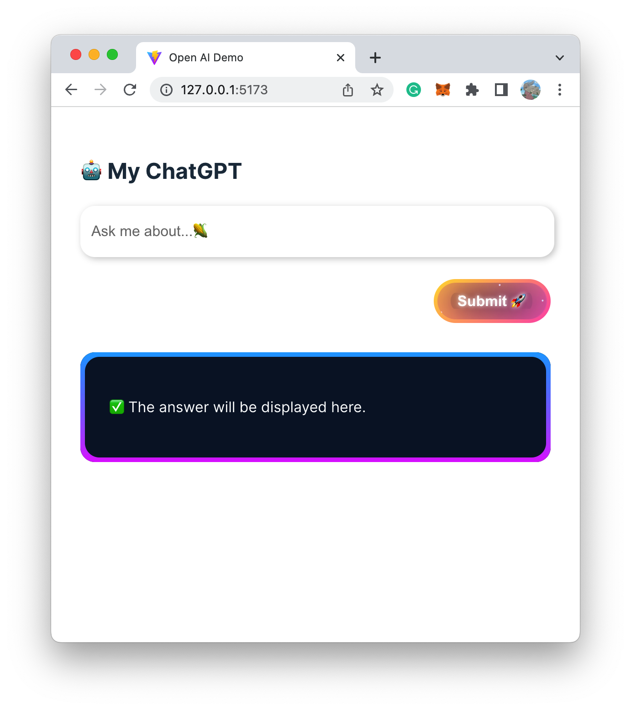

# openai-quickstart-vue

This is a quickstart template for using OpenAI's GPT-3 API in Vue 3.



## Setup

1. Clone this repository and navigate into the project directory

    ```shell
    git clone https://github.com/ysfscream/openai-quickstart-vue.git
    cd openai-quickstart-vue
    ```

2. Using `pnpm` to install dependencies
  
    ```shell
    pnpm install
    ```

3. Create the `.env` file to store your OpenAI API key and Orgnaization ID

    ```shell
    touch .env
    ```

4. Add your OpenAI API key and Orgnaization ID to the `.env` file

    ```shell
    # Example
    VITE_OPEN_API_KEY=xxxxxxxx
    ```

5. Run the development server, and open [http://localhost:3000](http://localhost:3000) in your browser

    ```shell
    pnpm dev
    ```

6. Build the project for production

    ```shell
    pnpm build
    ```
